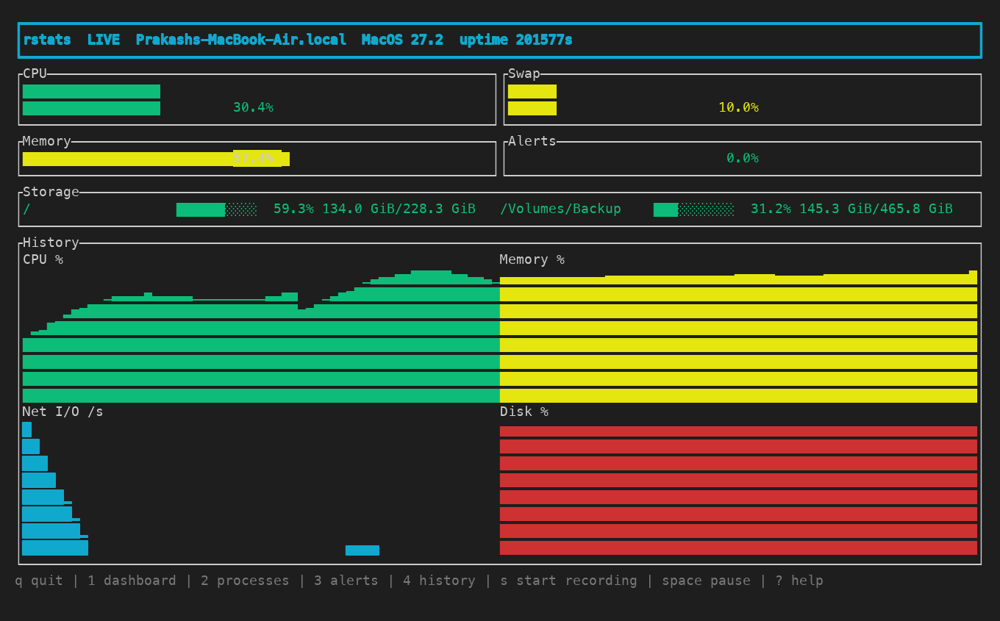
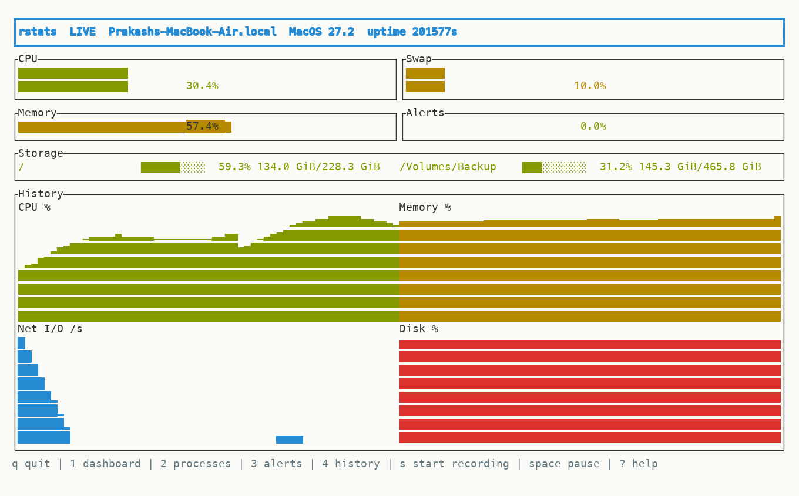
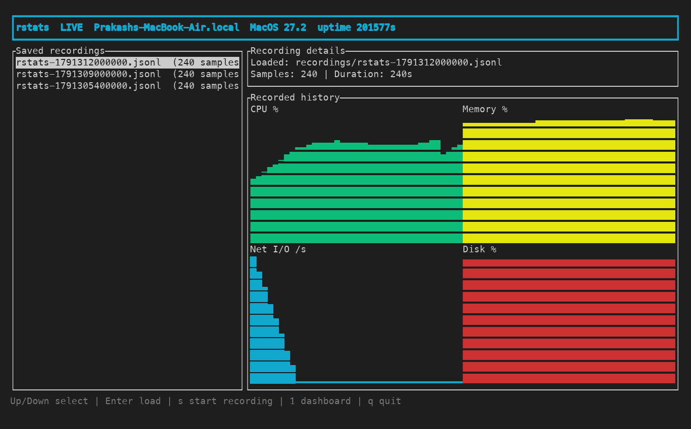
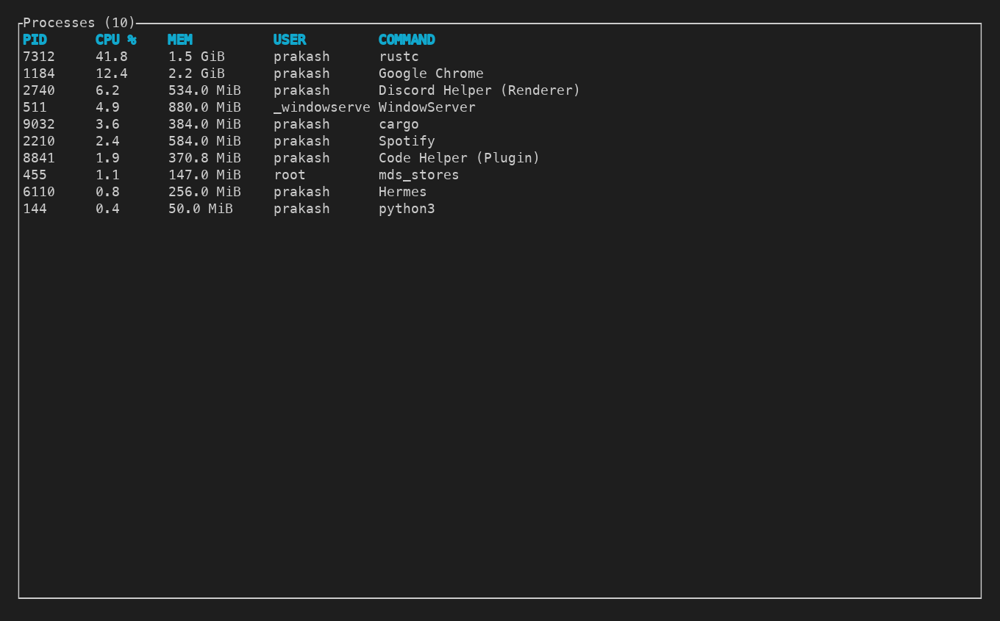

# rstats

[](https://github.com/PrakashSewani/rstats-cli/actions/workflows/ci.yml)
[](LICENSE)

`rstats` is a cross-platform Rust terminal dashboard for live system resources, processes, alerts, and recording history. It supports macOS, Linux, and Windows through a native executable and is distributed for end users through the `rstats-cli` npm package.



## Install with npm

```sh
npm install --global rstats-cli
rstats --monitor
```

Or run it without a global install:

```sh
npx rstats-cli --monitor
```

The npm package installs only the optional native package matching the current operating system and CPU architecture. It does not download binaries during installation or execution.

Supported npm targets:

| Operating system | Architectures |
| --- | --- |
| macOS | x64, arm64 |
| Linux | x64, arm64 |
| Windows | x64 |

## CLI commands

Plain `rstats` and `rstats --monitor` both launch the interactive terminal monitor. `--monitor` is the explicit form for scripts and documentation.

```sh
rstats
rstats --monitor
rstats --help
rstats --version
rstats --open-recordings
rstats --open-recordings --recording-dir ./my-recordings
```

`--open-recordings` creates and opens the configured recordings directory in the platform file manager. macOS uses `open`, Windows uses `explorer`, and Linux uses `xdg-open`; Linux users need `xdg-open` installed.

## Headless modes

`rstats --once` collects a single snapshot, prints a summary, and exits. `rstats --once --json` prints the full snapshot as JSON instead — handy for scripts and dashboards:

```sh
rstats --once --json | jq .cpu.total_usage
```

`rstats --watch` streams one plain-text line per interval until interrupted, flushing every line so it composes with pipes; timestamps are UTC:

```text
14:32:05  cpu 12.3%  mem 61.2%  swap 0.0%  load 2.14  net ↓1.2 MiB/s ↑300.0 KiB/s  disk 62.1%
```

`rstats --watch --json` streams one JSON object per line (JSON Lines) instead. Network rates are computed from cumulative interface counters; the first line shows `-` until a previous sample exists.

Headless modes conflict with `--monitor` and `--open-recordings`; `--json` requires `--once` or `--watch`.

## Exporting recordings

Convert a recorded session into a table or read a quick summary:

```sh
rstats --export recordings/rstats-1234567890.jsonl --format csv --output rstats.csv
rstats --export recordings/rstats-1234567890.jsonl --format json
rstats --report recordings/rstats-1234567890.jsonl
```

`--export` writes one row per sample — timestamp, CPU, memory, swap, load, network receive/transmit rates, and worst-disk usage — as CSV (default) or JSON. Output goes to stdout unless `--output FILE` is given. `--report` prints averages and peaks for each metric with the time offset of every peak.

The recording directory resolves in this order:

1. `--recording-dir DIRECTORY`
2. `recording_dir` in the TOML configuration file
3. `recordings` in the current working directory

The CLI modes are mutually exclusive: `--monitor --open-recordings` is rejected.

## Monitor controls

| Key | Action |
| --- | --- |
| `1`, `2`, `3`, `4` | Dashboard, processes, alerts, recording history |
| Up/Down | Select a saved recording on screen `4` |
| Enter | Load the selected recording into the charts |
| `s` | Start/stop recording |
| `q`, Ctrl-C | Quit and finalize any active recording |
| Space | Pause/resume updates |
| `R` | Reset live history |
| `c`, `m` | Sort processes by CPU or memory |
| `r` | Reverse process sort |
| `t` | Cycle color theme |
| `?` | Toggle help |

## Features

- CPU usage with per-core data
- Memory and swap utilization
- Disk usage and cumulative network byte counters
- Load average where the platform provides it
- Dark, light, and mono color themes with live cycling
- Sortable and filterable process table
- Bounded CPU, memory, swap, load, network, and disk history with sparklines
- Sustained threshold alerts with severity, cooldown, and recovery thresholds
- Start/stop recording sessions to portable JSONL files
- Built-in recording catalog with CPU, memory, network, and disk charts
- Interrupted recordings remain loadable when valid samples were flushed

## Screenshots

Light theme:



Recording history — browse saved sessions and load CPU, memory, network, and disk charts:



Processes sorted by CPU, with sortable columns:



## Configuration

CLI arguments override values from the TOML file:

```toml
interval_ms = 1000
history_seconds = 300
recording_dir = "recordings"
no_color = false
bell = false
theme = "dark"

[[alerts]]
name = "high_cpu"
metric = "cpu.total"
operator = "greater_than"
threshold = 90.0
duration_seconds = 30
severity = "warning"
cooldown_seconds = 300
recovery_threshold = 85.0
```

Use a configuration file with:

```sh
rstats --monitor --config ~/.config/rstats/config.toml
```

The `theme` setting accepts `dark`, `light`, or `mono`. `--theme NAME` overrides the file, and pressing `t` cycles themes live in the TUI.

Supported alert metrics are `cpu.total`, `memory.used_percent`, `swap.used_percent`, and `load.average`. Supported operators are `greater_than`, `greater_than_or_equal`, `less_than`, and `less_than_or_equal`.

## Recording format

Press `s` to start or stop a session. Each session creates `rstats-<epoch-milliseconds>.jsonl` with one JSON object per line: a header, each collected sample, and a footer containing the stop time and sample count. The file is flushed after every sample.

Open screen `4` to browse saved sessions. Use Up/Down to select a file and Enter to load its CPU, memory, network, and disk charts directly inside the TUI. You do not need to open the JSONL file manually.

## Contributing

Bug reports and pull requests are welcome; see [CONTRIBUTING.md](CONTRIBUTING.md) for contributor checks and the release workflow.

## Maintainer and agent documentation

- [Agent guide](AGENTS.md) — first-read project rules and source map
- [Architecture](docs/ARCHITECTURE.md) — runtime flow, modules, TUI, storage, and recording format
- [Development](docs/DEVELOPMENT.md) — tests, packaging, CI, and releases
- [Maintainer skill](.commandcode/skills/rstats-cli-maintainer/SKILL.md) — repository-specific agent workflow

## Development

Run the Rust application from source:

```sh
cargo run --release -- --monitor
cargo run --release -- --open-recordings --recording-dir ./tmp-recordings
```

Run the quality checks:

```sh
cargo fmt --all -- --check
cargo check --all-targets
cargo clippy --all-targets --all-features -- -D warnings
cargo test --all-targets
npm run check-version
npm run validate-packages
npm test
```

## Publishing

`Cargo.toml` is the authoritative version source. Synchronize npm manifests before a release:

```sh
npm run sync-version
npm run check-version
npm run validate-packages
```

Create a version tag such as `v0.1.0` after the Rust and npm versions match. The release workflow builds native binaries for all supported targets, stages the five platform packages, validates `npm pack` contents, publishes platform packages first, and publishes `rstats-cli` last. Native binaries and runtime recordings are generated artifacts and are not committed to the repository.

## License

MIT
